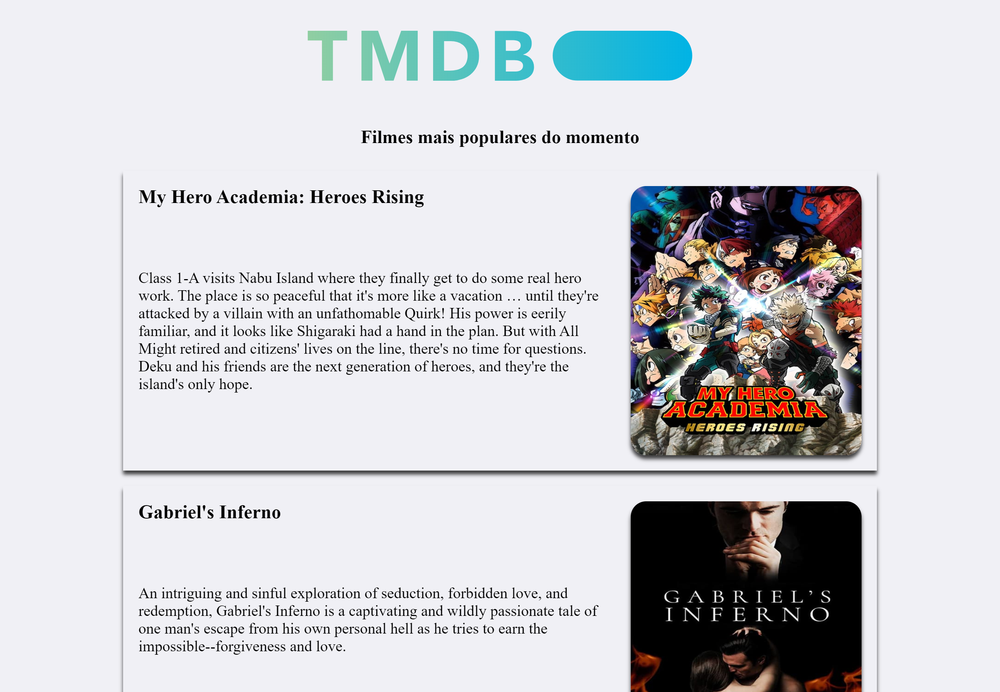

<p align="center">
    
</p>

<h2 align="center">Hello World Angular 🌍</h2>

### Objetivo deste projeto 📝

Conhecer, estudar e familiarizar-se com o Framework de desenvolvimento Angular

### O que foi feito? 🤔
Foi criado meu primeiro projeto angular, com o foco de consumir uma API RESTful. A API escolhida foi da [<strong>TMDB</strong>](https://developers.themoviedb.org/3/getting-started/introduction)

<div align="center">
    
</div>

## Tecnologias usadas 📚
- TMDB API
- Angular
- TypeScript
- HTML5
- CSS3

## Desenvolvimento 🎬

Clonando o repositório:

```
https://github.com/DanielSoaresRocha/HelloWorld-Angular.git
```

Navegando até a pasta do repositório:

```
cd HelloWorld-Angular/
```

Baixando as dependências

```
npm i
```
Rodando o projeto

```
npm start
```

## License 📝

This project is licensed under the [MIT License](https://opensource.org/licenses/MIT) - see the [LICENSE](LICENSE) file for details.

## Autor

<table>
  <tr>
    <td align="center"><a href="https://github.com/DanielSoaresRocha"><br /><sub><b>Daniel Soares</b></sub></a><br /><a href="https://github.com/DanielSoaresRocha/ESIG-challenge/commits?author=DanielSoaresRocha" title="Code">💻</a></td>
  <tr>
</table>


